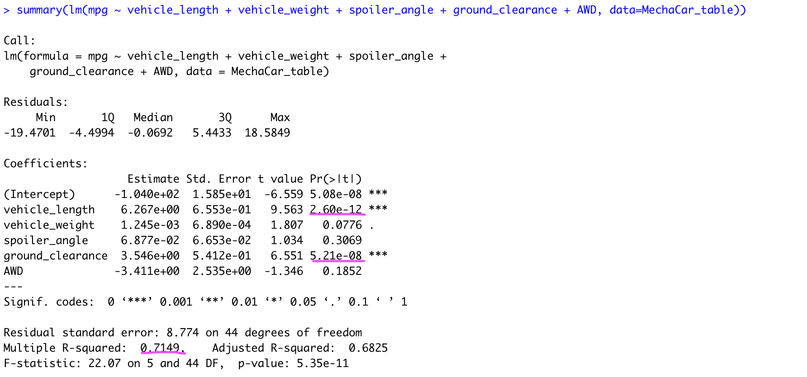
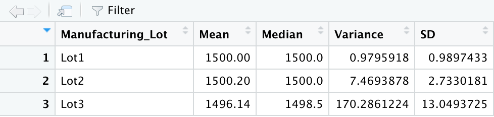

# MechCar_Statistical_Analysis
- Statistical Analysis on automotive data using R.
- MechaCar_MPG and Suspension_Coil datasets were provided.

## Linear Regression to Predict Miles Per Gallon (MPG)
Multiple linear regression was performed to understand the effect of independent variables Vehicle length, vehicle weight, spoiler angle, ground clearance, drive train (AWD) on the dependent variable vehicle performance measured in the form of "MPG". Results summary is as shown below :

</img>
- As we can observe from the P values for each of the independent variable in the "Pr(>|t|)" column, the vehicle_length and ground_clearance (marked with pink highlight) are far less than the assumed significance level of 0.05. Hence statistically the 2 independent variables "vehicle_length" and "ground_clearance" are providing non-random amount of variance to the mpg values in the dataset.

- Also looking at the summary (2 values underlined at the bottom) Multiple R-squared value which is 0.7149 with p-value being significant at 5.35e-11 (which is extremely below significance level of 0.05), we can easily infer that slope of the linear model is NOT 0. With R-squared being 0.71, we can see the linear regression line to be a positive slope.
- This multiple linear regression model surely predicts the mpg of Mechacar prototypes effectively as the R-squared value is 0.71 and p-value is significant. Though there are variables like vehicle_weight, spoiler_angle and AWD which have P values much higher than 0.05 are providing random amounts of variance to the model and hence can be handled by removing them from the model as they dont have any impact on MPG. Also, the P value of intercept is significant with 5.08e-08 which indicates that there are other variables and factors that contribute to the variation in MPG that have not been included in this model. Thus, lack of significant variables is evidence of overfitting of the model performing well with current dataset but can fail to generalize and predict future data correctly. Hence other significant variables should be identified and its measurements should be added for future analysis.

## Summary Statistics on Suspension Coils
Suspension coils were manufactured in 3 different lots and data of the coils were collected for all the 3 lots. On this data, basic stats Mean, Median, Variance and Standard Deviation were calculated for whole set of data and also grouping separately by each lot. The Stats summary for complete dataset is as follows:

</img>

- For the overall dataset, the mean is a bit lower than the median. The variance for the whole dataset comes to 62.29 PSI. Since the Variance is below 100 PSI, it meets the design specification.Although, the total variance is below the threshold variance limit set at 100 PSI, it still exceeds 50% of the set limit. This creates a need to see if this deviation is seen in all the 3 lots manufactured.

Summary stats for each lot is as follows:
</img>

-	The Lot 1 coils seem to be the best lot manufactured with no difference in Mean and Median with value of 1500.0. Also, the variance is 0.98 PSI less than 1 PSI.
- The Lot 2 coils seems to be just fine with Mean being 1500.20 and Median being 1500.0. Variance for Lot2 is around 7.5 PSI but seems acceptable when compared with variance limit set at 100 PSI. If only Lot1 and Lot2 were considered for the summary, overall variance would have stayed within 10% of the variance limit. Lot 1 and Lot 2 meet the design specification of MechaCar very well.
- The Lot 3 coils seem to be pretty bad with a variance of 170 PSI very much higher than the variance limit of 100 PSI. Hence Lot3 coils are not at all acceptable. These coils will be rejected and will not be used in MechaCar. Lot 3 does not meet the design specification. Also Lot 3 is a major contributor in making the overall variance as 62.3 PSI much higher than 50% of the set variance limit. As this is a bothering situation, Lot3 manufacturing process needs a thorough review to figure out and fix the steps contributing to this big error. Most common guess would be, as manufacturing units involve lot of wear and tear due to friction, maintainence of machinery will have to be taken up with high priority as we can see the trend of quality going down exponentially from Lot 2 to Lot3.

