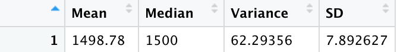
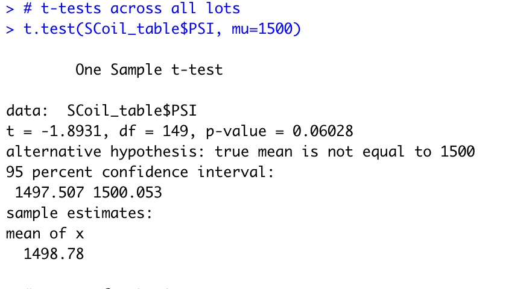
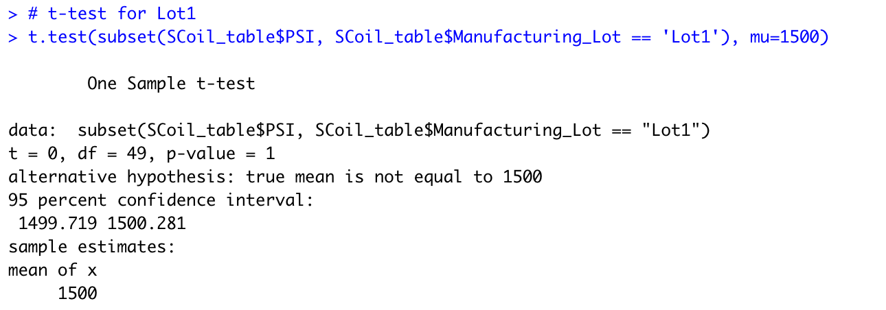
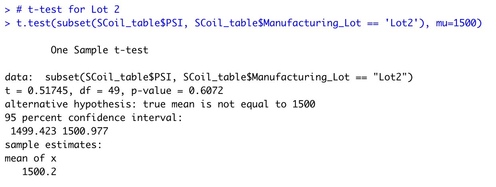
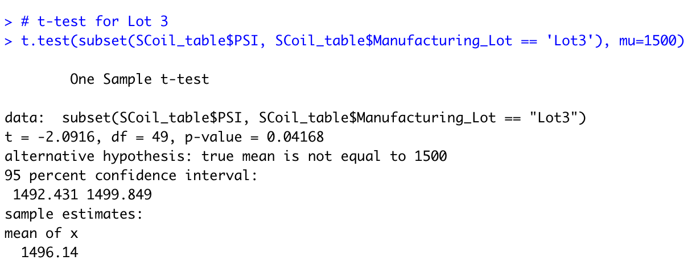

# MechCar_Statistical_Analysis
- Statistical Analysis on automotive data using R.
- MechaCar_MPG and Suspension_Coil datasets were provided.

## Linear Regression to Predict Miles Per Gallon (MPG)
Multiple linear regression was performed to understand the effect of independent variables Vehicle length, vehicle weight, spoiler angle, ground clearance, drive train (AWD) on the dependent variable vehicle performance measured in the form of "MPG". Results summary is as shown below :

</img>
- As we can observe from the P values for each of the independent variable in the "Pr(>|t|)" column, the vehicle_length and ground_clearance (marked with pink highlight) are far less than the assumed significance level of 0.05. Hence statistically the 2 independent variables "vehicle_length" and "ground_clearance" are providing non-random amount of variance to the mpg values in the dataset.

- Also looking at the summary (2 values underlined at the bottom) Multiple R-squared value which is 0.7149 with p-value being significant at 5.35e-11 (which is extremely below significance level of 0.05), we can easily infer that slope of the linear model is NOT 0. With R-squared being 0.71, we can see the linear regression line to be a positive slope.
- This multiple linear regression model surely predicts the mpg of Mechacar prototypes effectively as the R-squared value is 0.71 and p-value is significant. Though there are variables like vehicle_weight, spoiler_angle and AWD which have P values much higher than 0.05 are providing random amounts of variance to the model and hence can be handled by removing them from the model as they dont have any impact on MPG. Also, the P value of intercept is significant with 5.08e-08 which indicates that there are other variables and factors that contribute to the variation in MPG that have not been included in this model. Thus, lack of significant variables is evidence of overfitting of the model performing well with current dataset but can fail to generalize and predict future data correctly. Hence other significant variables should be identified and its measurements should be added for future analysis.

## Summary Statistics on Suspension Coils
Suspension coils were manufactured in 3 different lots and data of the coils were collected for all the 3 lots. On this data, basic stats Mean, Median, Variance and Standard Deviation were calculated for whole set of data and also grouping separately by each lot. The Stats summary for complete dataset is as follows:

</img>

- For the overall dataset, the mean is a bit lower than the median. The variance for the whole dataset comes to 62.29 PSI. Since the Variance is below 100 PSI, it meets the design specification.Although, the total variance is below the threshold variance limit set at 100 PSI, it still exceeds 50% of the set limit. This creates a need to see if this deviation is seen in all the 3 lots manufactured.

Summary stats for each lot is as follows:
</img>

-	The Lot 1 coils seem to be the best lot manufactured with no difference in Mean and Median with value of 1500.0. Also, the variance is 0.98 PSI less than 1 PSI.
- The Lot 2 coils seems to be just fine with Mean being 1500.20 and Median being 1500.0. Variance for Lot2 is around 7.5 PSI but seems acceptable when compared with variance limit set at 100 PSI. If only Lot1 and Lot2 were considered for the summary, overall variance would have stayed within 10% of the variance limit. Lot 1 and Lot 2 meet the design specification of MechaCar very well.
- The Lot 3 coils seem to be pretty bad with a variance of 170 PSI very much higher than the variance limit of 100 PSI. Hence Lot3 coils are not at all acceptable. These coils will be rejected and will not be used in MechaCar. Lot 3 does not meet the design specification. Also Lot 3 is a major contributor in making the overall variance as 62.3 PSI much higher than 50% of the set variance limit. As this is a bothering situation, Lot3 manufacturing process needs a thorough review to figure out and fix the steps contributing to this big error. Most common guess would be, as manufacturing units involve lot of wear and tear due to friction, maintainence of machinery will have to be taken up with high priority as we can see the trend of quality going down exponentially from Lot 2 to Lot3.

## T-Tests on Suspension Coils

T-tests were conducted on suspension coil dataset to determine if all manufacturing lots and each lot individually are statistically different from the population mean of 1500 PSI. The results are as follows for t-test on all lots :

</img>

 - T-test for all lots has a mean of 1498.78 PSI bit lesser than population mean of 1500 PSI. The p-value is 0.06 which is bit higher than desired significance level of 0.05. Though p-value has dropped very close to significance level, it is still a bit higher hence null hypothesis is still true!
 
 </img>
  - T-test for Lot1 is the most ideal similar to the observation in deliverable 2. The mean is 1500 PSI and p-value of 1, null hypothesis of sample mean being same as population mean (1500 PSI) is totally true for Lot1.
  
  
 </img>
 - T-test for Lot2 has mean of 1500.2 PSI and p-value of 0.6 much higher than 0.05, hence null hypothesis still holds good.
 
</img>
T-test for Lot3 has mean of 1496.14 PSI and p-value of 0.04 lesser than significance level 0.05. As p-value is less than 0.05 null hypothesis is rejected for Lot3. Lot3 has a different mean than the population mean of 1500 PSI.

## Study Design: MecaCar Vs. Competition
- AutosRUs' is coming up with a new car model MechaCar with specific objectives in mind. MechaCar is a brand which wants to take on small segment automotive market targeting the customers involved in short distance city commute on a daily basis. It intends to lure customers by keeping the cost light on the pocket, at the same time not compromising on the comfort and ease of use.
- With these objectives in mind, AutosRUs' team come up with list of metrics to be analyzed: cost, city fuel efficiency, maintenance cost, interior comfort, ease of use features provided in the vehicle.
- Cost, City fuel efficiency and maintenance cost are numerical continuous data.
- Interior comfort and Ease of use features are categorical - nominal data.
- Based on the type of data dealt as a metric, different type of tests will have to be used to analyze different datasets.
- A one sample t-test is ideal to analyze Cost, city fuel efficiency and maintenance cost of MechaCar with competition.
	- Sample is considered as MechaCar and population is considered as competition
  -	Each of the numerical metric of MechaCar is tested with corresponding metric of competition using one sample t-test.
  - T-test-Cost : Cost of Mechacar v/s costs of competition
    - Null Hypothesis = Ho : No statistical difference between MechaCar mean Cost & Competition mean cost
    - Alternative Hypothesis = Ha : MechaCar mean Cost is significantly less than competition mean cost
  - T-test-Fuel : City Fuel Efficiency of MechaCar v/s City Fuel efficiency of competition
    - Null Hypothesis = Ho : No statistical difference between MechaCar mean city fuel efficiency & Competition mean city fuel efficiency
    - Alternative Hypothesis = Ha : MechaCar mean city fuel efficiency is significantly more than competition mean city fuel efficiency
  - T-test-Maintenance : Maintenance cost of MechaCar v/s Maintenance cost of competition
    - Null Hypothesis = Ho : No statistical difference between MechaCar mean maintenance cost & Competition mean maintenance cost
    - Alternative Hypothesis = Ha : MechaCar mean maintenance cost is significantly less than competition mean maintenance cost
  - Data : Numerical data collected for cost, city fuel efficiency and maintenance cost from customers on MechaCar and its competition models over a period of time say an year or so can be used as dataset. Another way to collect this dataset especially cost and maintenance cost is through accessing the company records (sales and service to be specific). Cost of the car might be easily available as historical purchase price for cars is tracked.
-	A two-way ANOVA test is ideal to analyse interior comfort and ease of use features of MechaCar with competition.
    - MechaCar and its competition are comsidered as multiple samples or groups
    - Vehicle rating is tested based on 2 different independent variables interior comfort and ease of use features using 2-way ANOVA test
      - Null Hypothesis = Ho : Mean Vehicle ratings are equal for MechaCar & its competition
      - Alternative Hypothesis = Ha : Mean Vehicle rating of Mechacar is higher than its competition
    - Data: Different categories for interior comfort and ease of use features should be identified and listed. Based on these categories, customer ratings should be collected for MechaCar and its competition car models. Vehicle rating collected this way will form the dataset of Vehicle ratings for various models of car including MechaCar based on interior comfort and ease of use features. Data collected like this over a time period can be used for the analysis.

